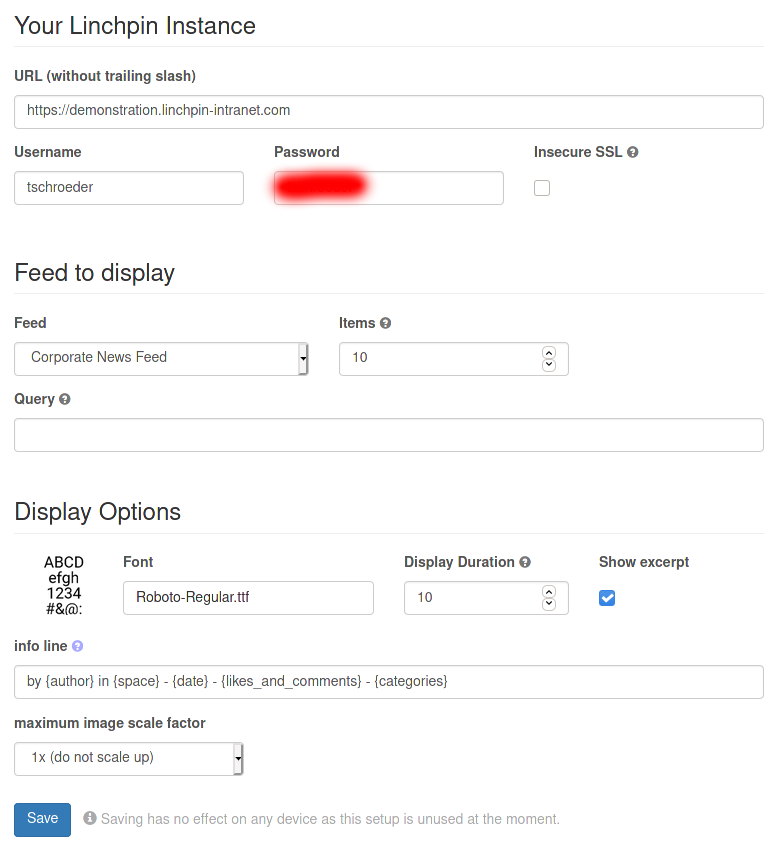

# Linchpin info-beamer node

This node displays the latest news of the Enterprise News Plugin for
Linchpin Server and Data Center.

Please note Linchpin Display does currently not support Linchpin Cloud.

## Settings

### Your Linchpin Instance

Here you need to set your linchpin URL and a valid username and password
for Linchpin Display to access your instance. If you're using a self
signed certificate, you also need to check the "Insecure SSL" checkbox,
which will disable SSL verification completely. There is no option to
upload a custom root certificate.

### Feed to display

This section allows you to select the Corporate or Personal News Feed,
the number of shown news items and a custom filter Query.

The filter query needs to be extracted manually from the developer
console in your browser:

- Create a new page in your confluence instance
- Add the Corporate News Bundle Macro to that page
- Use "Spaces" and "Labels" filter to select the content you want to show
- Open a developer console (F12) and open the "Network" tab
- Click "Preview" in the Macro
- Filter the Network tab for "corporate-news-feed"
- Copy the whole "config" parameter from the URL into the info-beamer
  settings menu, including the `{}`
- The page does not need to be saved for the filter to work

### Display Options

This panel will configure various output related options of your Display.
You are able to set the used Font, how long each news should be shown,
if you want to show an except of the news text and if you want to scale
*up* images. Downscaling to fit the images onto the screen will always
happen, it's not possible to disable that.

The last option is a Template for the info line, shown below everything
else. This is evaluated as a python format string, which supports the
following placeholders

- `{author}`: creator (full name)
- `{date}`: creation date (Thursday, 26.03. 16:57)
- `{likes_and_comments}`: likes and comments (23 likes, 42 comments)
- `{space}`: space name
- `{categories}`: Comma separated list of categories the post is filed
  under.
